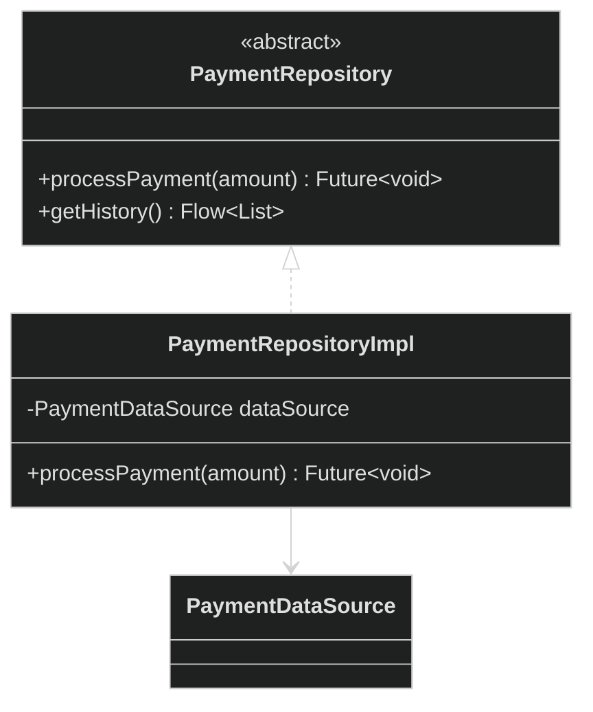
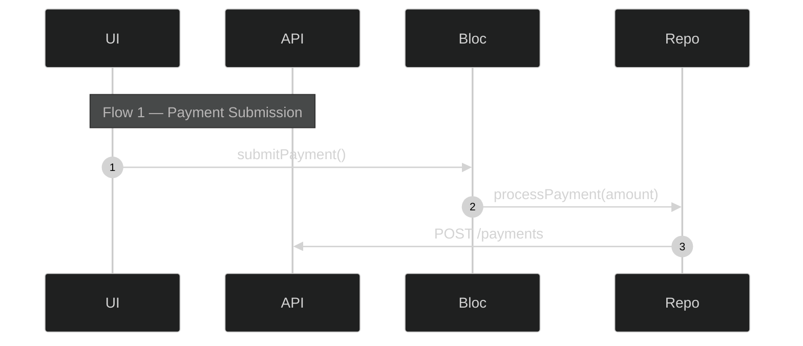

# code-diagram

An AI-powered skill that analyzes your actual source code and generates accurate Mermaid diagrams — class diagrams, sequence diagrams, component dependency graphs, and architecture overviews.

Point it at any directory or file. It reads the real code, detects the language and paradigm automatically, and outputs copy-pasteable Mermaid diagrams with a dark theme.

**No configuration needed.** It works out of the box for 8 languages and 3 programming paradigms.

---

## Table of Contents

- [Why This Exists](#why-this-exists)
- [What It Does](#what-it-does)
- [Supported Tools](#supported-tools)
- [Installation](#installation)
- [Usage](#usage)
- [Diagram Types](#diagram-types)
- [How It Works Under the Hood](#how-it-works-under-the-hood)
- [Supported Languages](#supported-languages)
- [Scale Handling](#scale-handling)
- [FAQ](#faq)
- [Contributing](#contributing)
- [License](#license)

---

## Why This Exists

Existing diagram tools either:
- Generate from text descriptions, never touching your actual code
- Read every file (expensive, slow, hits context limits on large features)
- Only support one language or paradigm
- Produce class diagrams for React components (wrong paradigm entirely)

**code-diagram** fills the gap: it parses real source code using a grep-first strategy, detects whether your codebase is OOP, component-based, or functional, and generates the right kind of diagram for your paradigm. It scales from a single file to 200+ file features without blowing up your token budget.

---

## What It Does

Given a path to a directory or file, it:

1. Scans all source files (excludes tests, generated code, i18n automatically)
2. Detects the language (Dart, TypeScript, Python, Java, Go, etc.)
3. Detects the paradigm (OOP, Component-based, Functional, or Mixed)
4. Runs targeted grep passes to extract classes, relationships, HTTP calls, imports, and DI patterns — without reading every file
5. Identifies foundational files using structural signals (not naming conventions)
6. Reads only the files that matter (max 20 per run)
7. Generates Mermaid diagrams with dark theme, ready to paste into GitHub, Notion, mermaid.live, or any Mermaid renderer

---

## Supported Tools

| Tool | File | How it works | Status |
|---|---|---|---|
| **Claude Code** | `skills/code-diagram/SKILL.md` | Native slash command: `/code-diagram` | Primary |
| **Cursor** | `cursor/.cursorrules` | Project rules — ask naturally in chat | Supported |
| **Gemini CLI** | `gemini/.gemini/commands/code-diagram.md` | Native slash command: `/code-diagram` | Supported |
| **ChatGPT** | `chatgpt/SYSTEM_PROMPT.md` | Custom instructions + zip upload | Experimental |

The Claude Code version is the **primary and most complete** (681 lines). Cursor and Gemini CLI are fully ported adaptations with the same analysis pipeline. The ChatGPT version is experimental — it requires manual code upload since ChatGPT cannot access your local filesystem.

---

## Installation

### Claude Code

**Option A — Marketplace (recommended):**
```
/plugin marketplace add usamaijazmughal/code-diagram-skill
/plugin install code-diagram
```

**Option B — Manual:**
```bash
mkdir -p ~/.claude/skills/code-diagram
curl -o ~/.claude/skills/code-diagram/SKILL.md \
  https://raw.githubusercontent.com/usamaijazmughal/code-diagram-skill/main/skills/code-diagram/SKILL.md
```

Restart Claude Code. Type `/code-diagram` — it will autocomplete.

**How to use:**
```
/code-diagram lib/features/payments
/code-diagram lib/features/payments sequence
/code-diagram lib/features/payments class split
/code-diagram src/auth split
```

---

### Cursor

**Step 1 — Install:**

Copy the `.cursorrules` file into your project root:
```bash
curl -o /path/to/your/project/.cursorrules \
  https://raw.githubusercontent.com/usamaijazmughal/code-diagram-skill/main/cursor/.cursorrules
```

Or clone and copy:
```bash
git clone https://github.com/usamaijazmughal/code-diagram-skill.git
cp code-diagram-skill/cursor/.cursorrules /path/to/your/project/
```

**Step 2 — Use:**

Open Cursor chat and ask naturally:

- *"Analyze lib/features/payments and generate all diagrams"*
- *"Generate a sequence diagram for src/auth"*
- *"Show me the class diagram for this feature, split by layer"*
- *"Create an architecture overview of src/components/checkout"*

Cursor reads the `.cursorrules` file automatically and follows the analysis pipeline. It uses `rg` (ripgrep), `find`, and `cat` for file operations instead of Claude Code's built-in tools.

---

### Gemini CLI

**Step 1 — Install:**

Copy the command file into your project:
```bash
mkdir -p /path/to/your/project/.gemini/commands
curl -o /path/to/your/project/.gemini/commands/code-diagram.md \
  https://raw.githubusercontent.com/usamaijazmughal/code-diagram-skill/main/gemini/.gemini/commands/code-diagram.md
```

**Step 2 — Use:**

The `/code-diagram` slash command will be available:

```
/code-diagram lib/features/payments
/code-diagram lib/features/payments sequence
/code-diagram src/components/auth class split
```

Same argument format as Claude Code. Gemini CLI uses shell commands (`rg`, `find`, `cat`) under the hood.

---

### ChatGPT (Experimental)

> ChatGPT cannot access your local filesystem. This version requires manual code upload and works best with smaller features. For the full experience, use Claude Code, Cursor, or Gemini CLI.

**Step 1 — Set up:**

1. Open [`chatgpt/SYSTEM_PROMPT.md`](chatgpt/SYSTEM_PROMPT.md)
2. Copy everything below the `---` line
3. Paste into one of:
   - **Custom Instructions** (Settings > Personalization > Custom Instructions)
   - **GPT Builder** (if creating a custom GPT)
   - Or just paste at the start of any conversation

**Step 2 — Provide your code:**

- **Zip upload** — compress your feature directory and upload it
- **Paste** — paste the relevant files directly into the chat
- **GitHub URL** — if ChatGPT has browsing enabled, provide the repo URL

**Step 3 — Ask:**

- *"Analyze the uploaded code and generate all diagrams"*
- *"Generate a sequence diagram for the payment flow"*
- *"Show me the architecture of this feature"*

---

## Usage

### Arguments

```
/code-diagram <path> [diagram-type] [flow-mode]
```

| Argument | Values | Default | Required |
|---|---|---|---|
| `path` | Any file or directory path | — | Yes |
| `diagram-type` | `class`, `sequence`, `component`, `arch`, `all` | `all` | No |
| `flow-mode` | `full`, `split` | `full` | No |

Smart argument parsing: if you skip the diagram type and go straight to flow mode, it works:

```bash
/code-diagram lib/app split        # → all diagrams, split mode
/code-diagram lib/app sequence     # → sequence only, full mode
/code-diagram lib/app class split  # → class only, split mode
```

### Flow modes explained

**`full` (default)** — One unified diagram per type.
- Sequence diagrams group multiple flows inside a single diagram using colored `rect` sections
- Class diagrams show all entities in one view
- Best for: documentation, onboarding, getting the full picture

**`split`** — Multiple focused diagrams.
- Sequence: one diagram per logical flow (init, happy-path, error, etc.)
- Class: one diagram per layer (data / domain / presentation)
- Architecture: one per subsystem + integration diagram
- Best for: large features, detailed exploration, presentations

---

## Diagram Types

### `class` — Structure Diagram

Visualizes all classes, interfaces, structs, and their relationships.

**What it shows per paradigm:**

| Paradigm | Diagram format | Entities | Relationships |
|---|---|---|---|
| OOP | `classDiagram` | Classes, interfaces, enums, mixins | Inheritance, composition, dependency |
| Component | `graph TB` tree | Components, hooks | Parent renders child |
| Functional | `graph LR` map | Modules, exported functions | Import dependencies |

**Example output (OOP):**


---

### `sequence` — Flow Diagram

Traces the execution flow from entry point to external boundary.

**What it shows per paradigm:**

| Paradigm | Flow traced |
|---|---|
| OOP | UI -> BLoC/ViewModel -> UseCase -> Repository -> API |
| Component | User -> Component -> Hook -> API Service -> State Update |
| Functional | HTTP Handler -> Business Logic -> Data Access -> External |

In **full mode**, multiple flows are grouped in one diagram with `rect` sections:


---

### `component` — Dependency Diagram

Shows what the feature depends on externally — HTTP endpoints, packages, services, databases.

Built entirely from grep results. **Zero file reads needed.** Works identically across all paradigms.

Flow mode is ignored — always produces one unified diagram.

---

### `arch` — Architecture Overview

Bird's-eye view of the feature's layer structure.

| Paradigm | Layers shown |
|---|---|
| OOP / Clean Architecture | Presentation / Domain / Data / External |
| Component-based | Pages / Components / Hooks / Services / State |
| Functional | Handlers / Business Logic / Data Access / External |

Flags architectural violations (e.g., Presentation calling Data directly, bypassing Domain).

---

## How It Works Under the Hood

### 5-Phase Pipeline

```
Phase 1    Phase 1.5      Phase 2         Phase 2.5          Phase 3         Phase 4        Phase 5
Discovery  Paradigm       Grep Scan       Structural         Selective       Diagram        Insights
           Detection                      Scoring            Reading         Generation
   |           |              |               |                  |               |              |
   v           v              v               v                  v               v              v
 Glob      3 probe       Language +      Tier 1/2/3        Read only       Mermaid        Hotspots,
 files     greps →       paradigm-      classification     what grep       output         violations,
 detect    OOP /         specific        (abstract,        can't tell      (dark          dependencies
 language  Component /   patterns        inheritance,       you             theme)
           Functional    (2 batched      import freq)
                         passes)
```

**Phase 1 — Discovery:** Finds all source files, excludes noise (tests, generated, i18n, build artifacts). Detects language from file extensions.

**Phase 1.5 — Paradigm Detection:** Three quick grep probes classify the codebase. Priority-ordered rules prevent misclassification (Angular = Mixed, not pure OOP).

**Phase 2 — Grep Scan:** Language and paradigm-specific patterns extract classes, relationships, HTTP calls, imports, and DI registrations. Two batched passes per language (down from 6 in earlier versions). **No files are read yet.**

**Phase 2.5 — Structural Scoring:** Identifies foundational files using 4 structural signals — not naming conventions. A class named `Payments` that 12 files extend will rank higher than `BaseHelper` that nothing extends. Signals: abstract keyword, inbound inheritance count, import frequency, generic type parameters.

**Phase 3 — Selective Reading:** Only reads files that grep can't fully explain. Class + sequence diagrams share a pool of max 20 reads. Component and architecture diagrams need **zero reads** — they're built entirely from grep data.

**Phase 4 — Generation:** Produces Mermaid diagrams with dark theme, proper guardrails (no HTML in labels, rect transparency for flow separation, 30-node cap per diagram).

**Phase 5 — Insights:** Reports paradigm confidence, entity distribution, external dependencies, read budget usage, and architectural hotspots.

### Cost-Effectiveness

| Optimization | Impact |
|---|---|
| Grep-first (never read before grepping) | Only 10-20% of files need full reading |
| Batched passes (2 per language, not 6) | ~50% fewer tool calls |
| Tiered reading (Tier 1 first, skip for component/arch) | Zero wasted reads |
| 30-node cap per diagram | Prevents token-heavy outputs |
| Auto-decompose for 100+ files | Distributes budget, no single bottleneck |

---

## Supported Languages

| Language | Paradigms Detected | Patterns Covered | Status |
|---|---|---|---|
| Dart / Flutter | OOP | Classes, mixins, GetIt DI, Dio/Retrofit HTTP, BLoC/ViewModel | Tested |
| TypeScript | OOP, Component, Functional | Classes, interfaces, React hooks, JSX, Angular decorators, Vue composition API | Tested |
| JavaScript | Component, Functional | React components, hooks, Express routes, fetch/axios | Tested |
| Java | OOP | Classes, interfaces, Spring annotations, Retrofit, Dagger DI | Tested |
| Kotlin | OOP | Data/sealed classes, Hilt/Dagger, Retrofit, coroutines | Tested |
| Python | OOP, Functional | Classes, Flask/FastAPI routes, requests/httpx, dependency injection | Covered |
| Go | Functional, Structural | Structs, interfaces (duck typing), method receivers, net/http | Covered |
| Swift | OOP | Classes, structs, protocols, extension conformance, URLSession | Covered |
| Rust | Structural, Trait-based | Structs, enums, traits, impl blocks, reqwest/actix/axum | Covered |
| Svelte | Component | `.svelte` files detected, component patterns | Covered |
| Vue | Component | Composition API, `ref`/`reactive`, `defineProps`/`defineEmits` | Covered |
| Angular | Mixed (OOP + Component) | `@Component`, `@Injectable`, `@Input`/`@Output`, services | Covered |

**Tested** = validated against real production codebases with verified diagram accuracy.
**Covered** = analysis patterns implemented and audited, awaiting community validation on diverse real-world projects.

---

## Scale Handling

| Feature Size | What Happens |
|---|---|
| **1 file** | Single-file mode: reads directly, focused diagram, notes cross-file limitations |
| **2–49 files** | Standard analysis: full grep + selective reads within 20-file budget |
| **50–99 files** | Grep-first: class diagrams auto-split by layer, sequence traces happy-path only |
| **100+ files** | Auto-decompose: splits by subdirectory, each analyzed independently with proportional read budget, integration diagram ties them together |

### Auto-Decompose Example (200 files)

```
lib/features/payments/ (200 files)

Auto-decomposing by subdirectory:
| Subdirectory    | Files | Reads allocated |
|-----------------|-------|-----------------|
| data/           | 45    | 4               |
| domain/         | 30    | 3               |
| presentation/   | 80    | 8               |
| di/             | 15    | 3               |

Each subdirectory gets its own diagrams.
Final integration diagram shows how they all connect.
```

---

## FAQ

**Q: Does it read every file in my project?**
No. It uses grep (pattern search) on all files — which is cheap — and only fully reads the most important 10-20 files. Component and architecture diagrams don't read any files at all.

**Q: What if my feature has 200+ files?**
Auto-decompose kicks in at 100+ files. It splits your feature by subdirectory, analyzes each independently, and generates an integration diagram showing how they connect.

**Q: What if my base classes don't have "Base" in the name?**
The skill uses structural signals, not naming conventions. A class named `Payments` that 12 files extend will be identified as foundational, while a class named `BaseHelper` that nothing extends will be skipped.

**Q: Can I use this on a monorepo?**
Yes, but point it at a specific feature directory, not the repo root. Pointing at the root of a monorepo would scan unrelated packages together.

**Q: What Mermaid version do I need?**
The diagrams use standard Mermaid syntax. `rect` blocks require Mermaid 9.3+. Dark theme (`%%{init: {'theme': 'dark'}}%%`) works in Mermaid 9+. The skill avoids `namespace` (Mermaid 10.3+ only) and uses comment separators instead for wider compatibility.

**Q: Where can I render the diagrams?**
- [mermaid.live](https://mermaid.live) — paste and render instantly
- **GitHub** — paste in any `.md` file, PR description, or issue
- **GitLab** — native Mermaid support in markdown
- **Notion** — paste in a code block with `mermaid` language
- **VS Code** — install the Mermaid preview extension

**Q: It produced a wrong diagram. What do I do?**
Open an issue with: the language, paradigm, feature size, and what was wrong. The more codebases we validate against, the better the patterns get.

---

## Repository Structure

```
code-diagram-skill/
├── skills/
│   └── code-diagram/
│       └── SKILL.md                    # Claude Code — for manual install (681 lines)
├── plugins/
│   └── code-diagram/
│       ├── .claude-plugin/
│       │   └── plugin.json             # Claude Code plugin metadata
│       └── skills/
│           └── code-diagram/
│               └── SKILL.md            # Claude Code — for marketplace install
├── cursor/
│   └── .cursorrules                    # Cursor (177 lines)
├── gemini/
│   └── .gemini/
│       └── commands/
│           └── code-diagram.md         # Gemini CLI (163 lines)
├── chatgpt/
│   └── SYSTEM_PROMPT.md                # ChatGPT — experimental (123 lines)
├── .claude-plugin/
│   └── marketplace.json                # Marketplace registry
├── README.md
└── LICENSE                             # MIT
```

---

## Contributing

1. **Test it** on your codebase — especially Python, Go, Swift, and Rust projects
2. **Report issues** with: language, paradigm, feature size, and what was wrong
3. **PRs welcome** for:
   - New language patterns (Elixir, Scala, C#, PHP, etc.)
   - Improved paradigm detection heuristics
   - Additional diagram types (ER diagrams, state machines, etc.)
   - Ports to other AI tools (Windsurf, Cody, Supermaven, etc.)

---

## License

MIT

---

Built by [Muhammad Usama Ijaz](https://github.com/usamaijazmughal)

